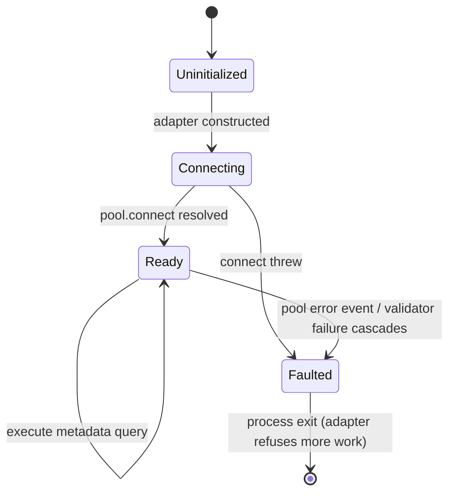

# Phase 1 Data Model – Real MSSQL Adapter

## Entity: `MssqlConnectionConfig`

| Field | Type | Source | Notes |
|-------|------|--------|-------|
| `envVarName` | string | constant (`MSSQL_CONNECTION_STRING`) | Documented in quickstart; never mutated at runtime. |
| `rawConnectionString` | string | `process.env.MSSQL_CONNECTION_STRING` | Trimmed and validated on startup; empty or malformed strings trigger a startup error. |
| `database` | string | tool input | Passed through to `ConnectionPool.request().input('database', ...)` for context tagging/logging only (connection string selects actual catalog). |
| `pool` | `mssql.ConnectionPool` | created once | Reused for all requests; exposes `.connected` state for readiness probes. |
| `status` | enum (`uninitialized` e `connecting` e `ready` e `faulted`) | derived | Logged for observability; transitions to `faulted` when pool emits `error` and adapter refuses additional work. |

**Relationships & Rules**:

- `pool` belongs to exactly one `MssqlConnectionConfig` and lives for the process lifetime.
- `database` labels every `MssqlMetadataQuery` (below) but does not affect the actual transport; drivers handle multi-database via `USE` statements, which are forbidden, so the adapter only tags responses.
- Validation rejects missing env vars before any MCP tool registration occurs to prevent half-configured servers.

## Entity: `MssqlMetadataQuery`

| Field | Type | Notes |
|-------|------|-------|
| `correlationId` | UUID v4 | Generated at the tool level and propagated through the adapter for log correlation. |
| `sqlText` | string | Must pass the read-only validator: starts with `SELECT`/`WITH`, contains zero semicolons, and references only `INFORMATION_SCHEMA`, `sys`, or DMV catalog views. |
| `parameters` | Record<string, string  number> | Future-ready placeholder; currently unused because queries are raw strings, but adapter normalizes to an empty object so instrumentation stays consistent. |
| `maxRows` | number | Upper bound (default 100) enforced before driver invocation to protect memory. |
| `executionWindow` | `{ startedAt: string; completedAt?: string }` | ISO timestamps captured before/after driver call. |

**Relationships & Rules**:

- Each MCP invocation spawns one `MssqlMetadataQuery`.
- `sqlText` is rejected if validator detects DML/DDL verbs, `;`, or references to non-whitelisted schemas; rejection happens before any driver call.
- Once executed, the query produces exactly one `MssqlQueryResult` (below) or an error.

## Entity: `MssqlQueryResult`

| Field | Type | Notes |
|-------|------|-------|
| `correlationId` | UUID v4 | Mirrors input for tracing. |
| `database` | string | Echoed from request for MCP UX parity. |
| `rows` | `QueryResultRow[]` | Array of JSON objects produced by catalog queries; trimmed to `maxRows`. |
| `executionStats` | `{ durationMs: number; rowCount: number }` | Derived from timestamps and row length for observability. |
| `startedAt` / `completedAt` | string | ISO timestamps returned to MCP clients (existing contract). |

**Relationships & Rules**:

- `rows` contain only scalar values retrieved from system catalogs; adapter strips driver metadata (e.g., column metadata objects) before returning.
- `executionStats` is logged but only `rowCount` is exposed via MCP response when helpful; even then it is computed, not raw server counters, to avoid leaking additional internal info.
- Error pathways skip `rows` and rely on the `LogWrapper` to format the driver error string while preserving `correlationId`.

## State Transitions

These states are logged so operators understand whether a failure stems from configuration (`Uninitialized`  `Connecting`) or runtime issues (`Faulted`).
