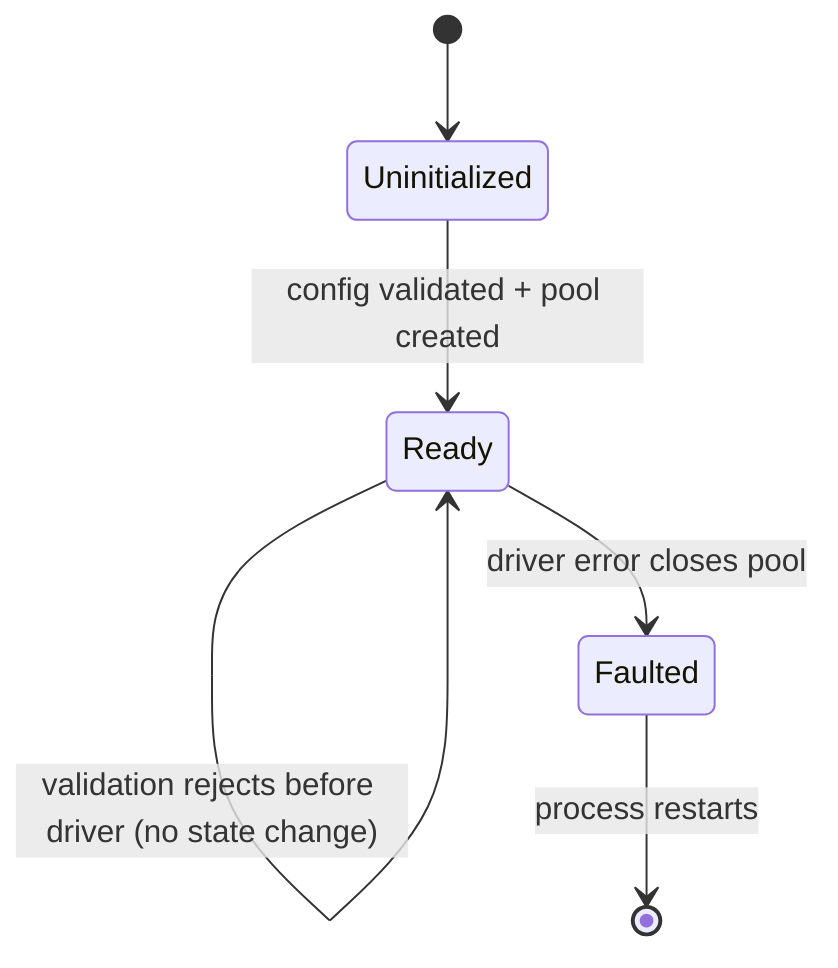

# Phase 1 Data Model – PostgreSQL Adapter Integration

## Entity: `PostgresConnectionConfig`

| Field | Type | Source | Notes |
|-------|------|--------|-------|
| `envVarName` | string | constant (`POSTGRES_CONNECTION_STRING`) | Documented for operators; never mutated at runtime. |
| `rawConnectionString` | string | `process.env.POSTGRES_CONNECTION_STRING` | Trimmed and validated as a URI; missing or malformed strings throw before adapter construction completes. |
| `pool` | `pg.Pool` | created once per process | Configured with SSL + `query_timeout`; reused by every metadata query. |
| `status` | enum (`uninitialized` → `ready` → `faulted`) | derived | Logged for observability; `faulted` halts new work until restart. |
| `sslMode` | `'require' | 'prefer' | 'disable'` | parsed option | Optional flag derived from connection string query params; used when bootstrapping the pool. |

**Relationships & Rules**

- Exactly one `PostgresConnectionConfig` exists per MCP process; the pool belongs to that config for its lifetime.
- Validation ensures both host and database segments exist, and optional SSL parameters are honored consistently so driver errors never leak secrets.
- Startup fails before MCP registration if validation throws, preventing half-configured adapters.

## Entity: `PostgresMetadataQuery`

| Field | Type | Notes |
|-------|------|-------|
| `correlationId` | UUID v4 | Provided by the calling tool; echoed through logs + responses. |
| `database` | string | Logical label surfaced back to MCP clients (does not change the actual catalog). |
| `sqlText` | string | Must pass the validation decorator: single statement, read-only, targets `pg_catalog`/`information_schema`/statistics views. |
| `maxRows` | number | Optional cap (default 100) enforced before returning JSON payloads. |
| `executionWindow` | `{ startedAt: string; completedAt?: string }` | ISO timestamps captured pre/post driver call. |
| `timeoutMs` | number | Derived from config (defaults 30_000) and passed to the `pg` query method. |

**Relationships & Rules**

- Each adapter invocation materializes one `PostgresMetadataQuery`; successful execution produces exactly one `PostgresQueryResult`.
- Validator rejects the query before driver access if it detects DDL/DML keywords, multiple statements, or forbidden schemas.
- `maxRows` cannot exceed the shared ceiling (100) and defaults when undefined to keep envelopes consistent with MSSQL.

## Entity: `PostgresQueryResult`

| Field | Type | Notes |
|-------|------|-------|
| `correlationId` | UUID v4 | Copied from the request for tracing. |
| `database` | string | Echo of the request field. |
| `queryResult` | `Record<string, unknown>[]` | JSON rows converted from `pg` result sets, truncated to `maxRows`. |
| `startedAt` / `completedAt` | string | ISO timestamps for MCP inspector timelines. |
| `rowCount` | number | Derived from `queryResult.length`; included in structured content for statistics queries. |
| `validationStatus` | `'validated' | 'rejected'` | Indicates whether driver execution occurred; `rejected` payloads hold strikethrough error strings. |

**Relationships & Rules**

- When validation fails, `queryResult` is empty and `validationStatus` is `rejected`, but the envelope still carries `correlationId` + timestamps for parity.
- Successful results never include binary Postgres types; arrays/JSONB fallback to their stringified representation so consumers remain engine-agnostic.
- Errors thrown by the driver bubble up; the adapter logs them with the correlation ID and surfaces them unchanged to MCP responses per FR-005.

## State Diagram

The adapter logs each transition so operators can distinguish configuration issues (failing to reach Ready) from runtime pool failures.
